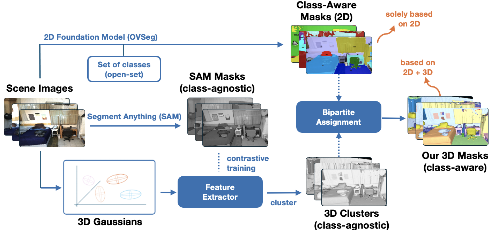

<span align="center">
<h1> DCSEG: Decoupled 3D Open-Set Segmentation using Gaussian Splatting</h1>

<a> Luis Wiedmann, Luca Wiehe, David Rozenberszki </a>

<a> [Paper](https://arxiv.org/abs/2412.10972) </a>

We present DCSEG, a holistic 3D reconstruction and scene understanding method. 
In the core of our method we leverage pretrained 2D foundation models such as SAM to recognize uniform semantic concepts in 2D images of 3D scenes, and use these predicted masks as contrastive optimization targets from multi-view images to class-agnostic 3D instances and object parts. These features are then used to cluster the Gaussians in 3D with hierarchical clustering methods. 
Simultaneously, we use a 2D semantic segmentation network to obtain class-aware masks and aggregate class-agnostic parts into meaningful semantic instances. As a results we obtain 2D/3D instance and semantic segmentation on synthetic and real world scenes

</span>




## Setup

### Setting up Environments
For using this repository, you will need two conda environments. One for OVSeg and one for SAGA/OpenNeRF. It is impossible to merge both of them into one environment because OVSeg uses `python>=3.8` and SAGA relies on `python<=3.7`.

#### DCSEG Environment
```python
conda create -n dcseg python=3.9

conda install cudatoolkit=11.8
pip install torch==2.1.2 torchvision==0.16.2 torchaudio==2.1.2 --index-url https://download.pytorch.org/whl/cu118
conda install -c rapidsai -c conda-forge -c nvidia cuml=24.06
conda install -c rapidsai -c conda-forge -c nvidia cugraph=24.06
conda install pytorch3d -c pytorch3d

pip install tqdm plyfile setuptools==69.5.1 opencv-python joblib==1.1.0 matplotlib scikit-learn hdbscan imageio
```

#### OVSeg Environment (see [here](https://github.com/facebookresearch/ov-seg/blob/main/INSTALL.md))
```python
conda create --name ovseg python=3.8
conda activate ovseg
conda install pytorch==1.10.1 torchvision==0.11.2 torchaudio==0.10.1 cudatoolkit=11.3 -c pytorch -c conda-forge
pip install -r requirements.txt

python -m pip install detectron2 -f https://dl.fbaipublicfiles.com/detectron2/wheels/cu113/torch1.10/index.html

cd thirs_party/ov-seg/third_party/CLIP
python -m pip install -Ue .
```

#### SAGA Environment
```python
cd src/third_party/segment_3d_gaussians
conda env create --file environment.yml
conda activate gaussian_splatting

pip install tqdm plyfile setuptools==69.5.1 opencv-python joblib==1.1.0 matplotlib scikit-learn hdbscan imageio
pip install -e submodules/diff-gaussian-rasterization
pip install -e submodules/diff-gaussian-rasterization_contrastive_f
pip install -e submodules/diff-gaussian-rasterization-depth
pip install -e submodules/simple-knn
pip install -e third_party/segment-anything
```

#### OpenNeRF Environment
```python
conda create --name opennerf -y python=3.10
conda activate opennerf
python -m pip install --upgrade pip

conda install nvidia/label/cuda-12.1.1::cuda
conda install pytorch==2.1.2 torchvision==0.16.2 torchaudio==2.1.2 pytorch-cuda=12.1 -c pytorch -c nvidia
python -m pip install ninja git+https://github.com/NVlabs/tiny-cuda-nn/#subdirectory=bindings/torch

cd third_party/opennerf
python -m pip install -e .
ns-install-cli

# Lets link the opennerf folder to our main repo folder (Feel free to link the to some remote file storage since they are quite big)
cd third_party/opennerf
ln -s dcseg/data data
ln -s dcseg/models models
ln -s dcseg/results/opennerf_outputs outputs
```

### Downloading Model Checkpoints

Download [OpenSeg feature extractor model](https://drive.google.com/file/d/1DgyH-1124Mo8p6IUJ-ikAiwVZDDfteak/view?usp=sharing) and unzip it into `dcseg/models/`.

Download [CLIP Model](https://huggingface.co/laion/CLIP-ViT-B-16-laion2B-s34B-b88K/resolve/main/open_clip_pytorch_model.bin) and place it inside `dcseg/segment_3d_gaussians/clip_ckpt/` as `ViT-B-16-laion2b-s34b_b88k.bin`.

Download [SAM Checkpoint](https://dl.fbaipublicfiles.com/segment_anything/sam_vit_h_4b8939.pth) and place it inside `dcseg/segment_3d_gaussians/third_party/segment-anything/sam_ckpt/` as `sam_checkpoint.pth`.

Download [OVSeg Checkpoint](https://drive.google.com/file/d/1cn-ohxgXDrDfkzC1QdO-fi8IjbjXmgKy/view?usp=sharing) and place it inside `dcseg/ov-seg/models/`

### Downloading the Data

#### Replica

Download the Replica dataset pre-processed by [NICE-SLAM](https://pengsongyou.github.io/nice-slam) and transform it into nerfstudio format using these steps:
```python
cd data
wget https://cvg-data.inf.ethz.ch/nice-slam/data/Replica.zip
unzip Replica.zip
cd ..
python data_processing/replica_replica_preprocess #(comes from opennerf/datasets/replica_preprocess.py)
```

#### ScanNet

Download the scenes through their official website  
Extract the data in the correct format as described in `dcseg/src/data_processing/demo.ipynb`

## Running the Code
In the following section, we will describe the scripts that need to be executed to obtain a segmented reconstruction. Note that you can check out the `benchmark_scenes.py` to see the complete workflow in a single file.

The pipeline is always broken down into the following parts:
1. Preprocess Data
2. Train 3D Representation and propose class-agnostic clusters
3. Predict class-aware masks
4. Assign clusters to masks
5. Evaluate & Visualize

## Repository Structure
```
|-- dcseg
   |-- data:
      |-- nerfstudio:
         |-- scannet_{scene}
            |-- color
            |-- depth
            |-- intrinsic
            |-- pose
            mesh.ply
         ...
         |-- replica_{scene}
            |-- images
            |-- depths
            mesh.ply
            transforms.json
         ...
      |-- gt: 
         scene0000.00.txt
         ...
   |-- models:
      |-- ovseg_ckpt
      |-- openseg_exported_clip
      |-- sam_ckpt
   |-- results: 
      |-- metrics
      |-- opennerf_outputs
      |-- ovseg_masks
      |-- saga_masks
      |-- pr_semantics
      |-- semantic_labels
      |-- splatting_models
   |-- src
      |-- data_processing
         |-- replica
         |-- scannet
         demo.ipynb
      |-- eval
         |-- helpers
         ...
         demo.ipynb
      |-- mask_classification
         |-- assignment_classifier
         ...
         demo.ipynb
      |-- mask proposal
         |-- saga_seg
         ...
         demo.ipynb
      |-- third_party
         |-- opennerf
         |-- ov-seg
         |-- segment_3d_gaussians
      |-- utils
      benchmark_scenes.py
      files.py
```

## Citation
If you find this work helpful, please cite
```
@misc{wiedmann2024dcsegdecoupled3dopenset,
      title={DCSEG: Decoupled 3D Open-Set Segmentation using Gaussian Splatting}, 
      author={Luis Wiedmann and Luca Wiehe and David Rozenberszki},
      year={2024},
      eprint={2412.10972},
      archivePrefix={arXiv},
      primaryClass={cs.CV},
      url={https://arxiv.org/abs/2412.10972}, 
}
```
